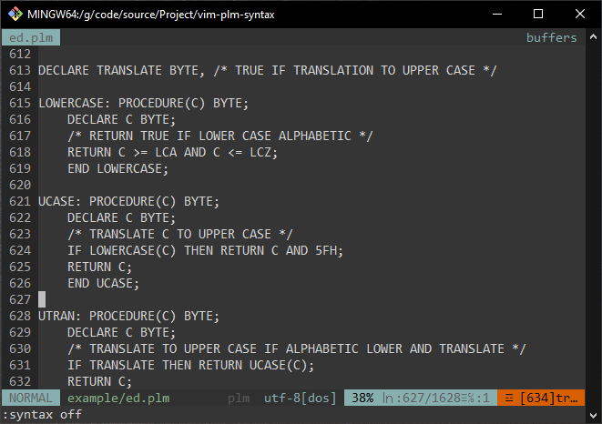
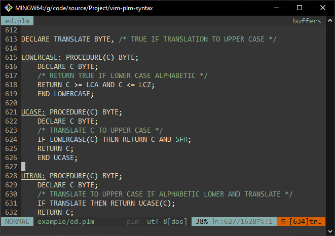

# PL/M Syntax Highlighting for Vim

Vim Syntax Highlighting for the PL/M Programming Language.

[PL/M](https://en.wikipedia.org/wiki/PL/M), Programming Language for Micro-Proccessor Computers, is a programming language developped by [Gary Kildall](https://en.wikipedia.org/wiki/Gary_Kildall) in 1973 for the [intel 8008 micro-processor](https://en.wikipedia.org/wiki/Intel_8008). The language itself was based off the practices of various before it, namely: [PL/I](https://en.wikipedia.org/wiki/PL/I), [ALGOL](https://en.wikipedia.org/wiki/Algol), and [XPL](https://en.wikipedia.org/wiki/XPL). Gary Kildall later went on to write the [CP/M operating system](https://en.wikipedia.org/wiki/CP/M), utilizing the language to write much of the code for the operating system.

PL/M is often creditted as being the first High-Level Language written specifically for micro-computers.

## Install

<details>
  <summary>Vim 8 Package Manager</summary>

  <br>

  Installing the plugin as a Vim 8 Package

  $ as user  
  \# as root  

```
$ mkdir -pv ~/.vim/pack/*/start/  
$ cd ~/.vim/pack/*/start  
$ git clone git@github.com:sage-etcher/vim-plm-syntax.git  

  or  

$ git clone https://github.com/sage-etcher/vim-plm-syntax.git  
```

</details>

## Examples

Vim (and the vast majority of modern code edittors) lack proper syntax highlighting for the language, mainly due to it's age. So, rather than being condemned to choose between editting files in plain text or a spotty "catch all" syntax highlighting script, you can get custom syntax highlighting, that was designed for the language, here!!

<details>
  <summary>Standard Vim Plain Text</summary>

  <br>

  Everyone knows what plain text looks like, but for comparison, this is the same code throughout. First, in plain text view.

  

</details>

<details>
  <summary>Standard Vim (no plugin)</summary>

  <br>

  The default vim "generic" syntax hightlighting does an alright job with PL/M due to it's generic looking syntax. But, if you look closely you may start to see some issues, the most glaring is the it often grabs HEX characters where they should be variables, or functions, or even comments. And it lacks support for many of the built in procedures.

  

</details>

<details>
  <summary>With the Plugin</summary>

  <br> 

  Here you can see the language being highlighted in a clear manner, variables aren't getting confused for hex, comments are always hightlighted as comments, and overall, it works like a gem.

  

</details>

## Open Source License (Apache version 2.0)

Copyright 2023 Sage I. Hendricks  

Licensed under the Apache License, Version 2.0 (the "License");  
you may not use this file except in compliance with the License.  
You may obtain a copy of the License at  

&nbsp;&nbsp;&nbsp;&nbsp;<http://www.apache.org/licenses/LICENSE-2.0>  

Unless required by applicable law or agreed to in writing, software  
distributed under the License is distributed on an "AS IS" BASIS,  
WITHOUT WARRANTIES OR CONDITIONS OF ANY KIND, either express or implied.  
See the License for the specific language governing permissions and  
limitations under the License.  

